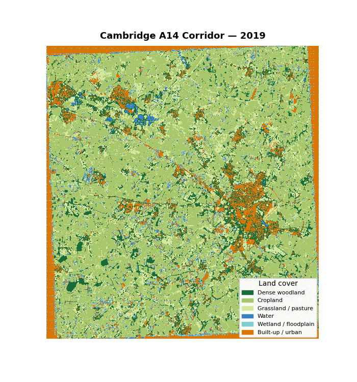
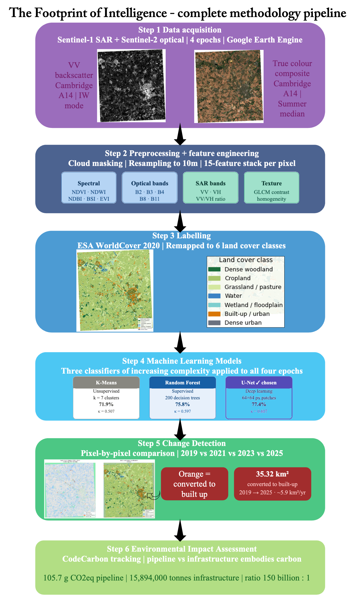
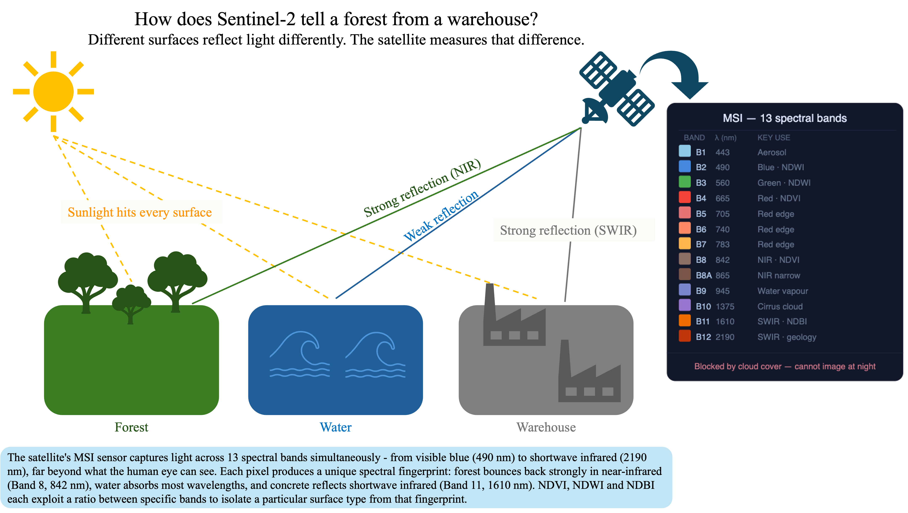
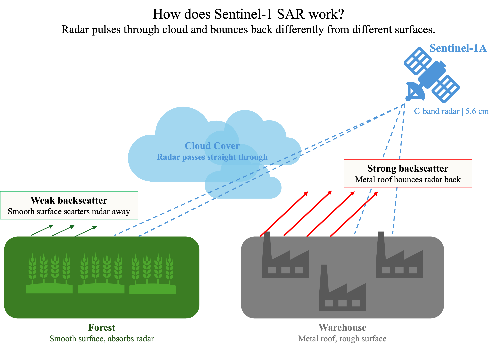
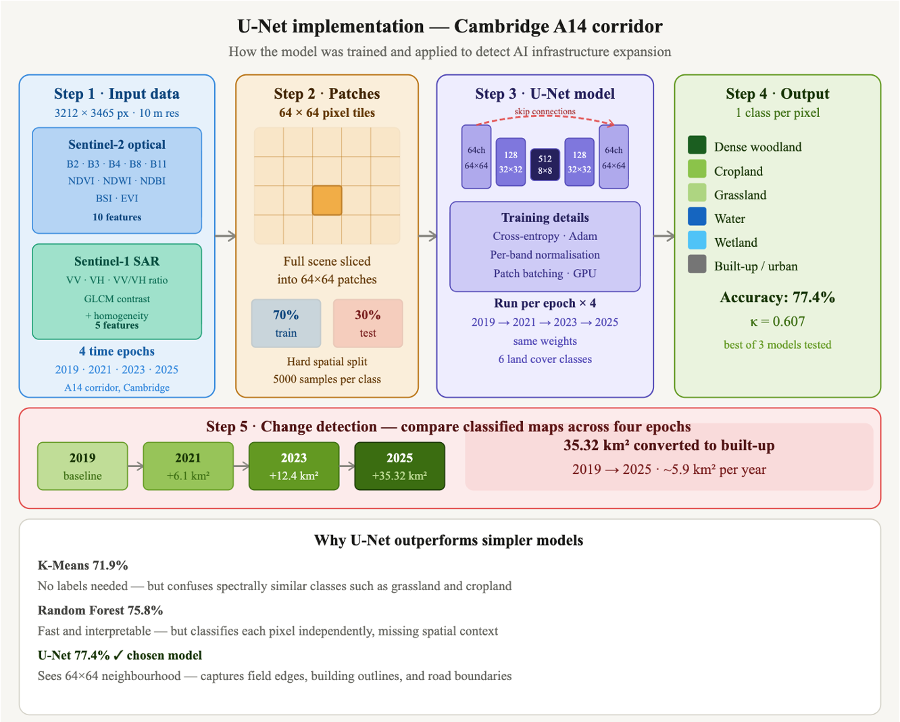

<h3 align="center">The Footprint of Intelligence</h3>
<h3 align="center">AI-Assisted Land Cover Change Detection — Cambridge A14 Corridor, 2019–2025</h3>

<p align="center">
  
</p>

> *"This is what the AI economy looks like from 786 kilometres above the Earth." - Ariella Morris, 2026 (author)*

This project deploys a machine learning pipeline to detect and quantify the physical 
expansion of AI infrastructure — data centres, logistics warehouses, and industrial 
development — across the Cambridge A14 corridor between 2019 and 2025, using 
multi-temporal Sentinel-1 and Sentinel-2 satellite imagery.

The project then turns the same accounting framework on itself, measuring the carbon, 
energy, and water cost of the classifier doing the detecting, and comparing it to the 
embodied carbon of the infrastructure it found.

<p align="center">
  
  <br>
  <em>Figure 1. Complete methodology pipeline for AI infrastructure detection 
  across the Cambridge A14 corridor. Sentinel-1 SAR and Sentinel-2 optical 
  imagery are acquired for four epochs (2019, 2021, 2023, 2025) via Google 
  Earth Engine, preprocessed to a 15-feature stack per pixel, and labelled 
  using ESA WorldCover 2020 remapped to six land cover classes. Three 
  classifiers of increasing complexity — K-Means (71.9%), Random Forest 
  (75.8%), and U-Net (77.4%) — are evaluated against a hard spatial 
  train/test boundary. U-Net change detection identifies 35.32 km² of 
  built-up expansion between 2019 and 2025. The full pipeline produces 
  105.7 g CO₂eq — approximately 150 billion times less than the embodied 
  carbon of the infrastructure it detects.</em>
</p>
---

## Table of Contents
- [The Research Question](#the-research-question)
- [Key Results](#key-results)
- [Repository Structure](#repository-structure)
- [Getting Started](#getting-started)
- [Study Area](#study-area)
- [Remote Sensing Methodology](#remote-sensing-methodology)
- [Machine Learning Methodology](#machine-learning-methodology)
- [Interactive Map](#interactive-map)
- [Environmental Analysis](#environmental-analysis)
- [Discussion and Implications](#discussion-and-implications)
   - [Limitations](#limitations)
- [Video Walkthrough](#video-walkthrough)
- [Contact](#contact)
- [Acknowledgements](#acknowledgements)
- [References](#references)

---

## The Research Question

Can a machine learning pipeline detect and quantify the conversion of agricultural 
land to AI-related infrastructure across the Cambridge A14 corridor between 2019 
and 2025, and what is the environmental cost of the detection pipeline compared to 
the infrastructure it detects?

## The problem

The physical infrastructure of the AI economy — data centres, logistics 
networks, semiconductor facilities — is expanding faster than any existing 
monitoring system can track. Global data centre capacity is projected to 
double by 2030, yet the land use transformation this requires remains largely 
invisible in published land cover datasets, which are updated infrequently 
and at insufficient resolution to capture rapid peri-urban development.

In Cambridgeshire, demand for logistics and industrial development has intensified rapidly along key transport corridors such as the A14, with major proposals emerging at sites including Bourn Airfield and Bar Hill (Greater Cambridge Shared Planning, 2023; Swavesey Parish Council, 2025). This reflects a broader UK trend towards increasingly large “big box” distribution centres, commonly exceeding 100,000 sq ft and in some cases surpassing 1 million sq ft (~93,000 m²) (Savills, 2024; Savills, 2025). Yet no satellite-derived land cover product captures this transition at sufficient spatial or temporal resolution to inform local planning decisions.

The Cambridge A14 corridor is one of the fastest-growing AI infrastructure zones in 
Europe. Between 2019 and 2025, a string of warehouse complexes, data centre campuses, 
and logistics parks emerged across sites, including Bourn Airfield, Bar Hill, Swavesey, 
and Waterbeach — quietly converting farmland and grassland at a rate that no published 
land cover dataset has yet to be captured.

This project asks a simple question: can satellite imagery and machine learning detect 
that expansion automatically, accurately, and cheaply enough to make continuous 
monitoring viable?

To answer it, I combine Sentinel-1 SAR radar and Sentinel-2 multispectral imagery 
across four time epochs — 2019, 2021, 2023, and 2025 — and apply three machine learning 
classifiers to map land cover change at 10 m resolution across a 1,200 km² study area. 
I then progress to ask a second question that the first makes unavoidable: what does it cost, in 
carbon, to run this pipeline — and how does that compare to the infrastructure it is 
detecting?

---

## Key Results

| Model | Overall Accuracy | Cohen's Kappa | Weighted F1 |
|---|---|---|---|
| K-Means (unsupervised baseline) | 71.9% | 0.507 | 0.722 |
| Random Forest (supervised) | 75.8% | 0.597 | 0.786 |
| U-Net (deep learning) | 77.4% | 0.607 | 0.793 |

**U-Net per-class performance:**

| Class | F1 Score | Notes |
|---|---|---|
| Dense woodland | 0.72 | High NDVI contrast aids separation |
| Cropland | 0.90 | Strong spectral signal — highest performing class |
| Grassland / pasture | 0.58 | Spectrally similar to cropland |
| Water | 0.12 | Very few water pixels in study area — model rarely predicts this class |
| Wetland/floodplain | 0.00 | Underrepresented in study area — never correctly classified |
| Built-up / urban | 0.54 | SAR backscatter critical for separation |

**Land cover change detected (2019–2025):**
- 35.32 km² of agricultural and greenfield land converted to built-up/urban
- Annual expansion rate: ~5.9 km²/year across the A14 corridor

**Environmental finding:**
- Pipeline carbon footprint: **0.106 kg CO₂eq**
- Embodied carbon of detected infrastructure: **~15,894,000 tonnes CO₂eq**
- The infrastructure being detected emits approximately **150 billion times** more 
carbon than the pipeline used to detect it

---

## Repository Structure
```
footprint-of-intelligence/
├── README.md
├── ENVIRONMENTAL_IMPACT.md
├── environment.yml
├── notebooks/
│   ├── 00_data_download.ipynb
│   ├── 01_preprocessing.ipynb
│   ├── 02_feature_engineering.ipynb
│   ├── 03_labelling.ipynb
│   ├── 04_models.ipynb
│   ├── 05_change_detection.ipynb
│   ├── 06_environmental_impact.ipynb
│   └── 07_visualisation.ipynb
├── outputs/
│   ├── classification_animated.gif
│   ├── interactive_map.html
│   ├── change_map_2019_2025.png
│   ├── unet_confusion_matrix.png
│   ├── unet_feature_sensitivity.png
│   ├── rf_confusion_matrix.png
│   ├── rf_feature_importance.png
│   ├── summary_panel.png
│   ├── area_statistics.png
│   ├── sentinel1_diagram.png
│   ├── sentinel2_diagram.png
│   ├── unet_diagram.png
│   └── pipeline_flowchart.png
└── data/
    └── README.md
```
---

## Getting Started

### Requirements
```bash
pip install earthengine-api rasterio scikit-learn torch torchvision 
pip install folium imageio codecarbon scikit-image
```

Or use the provided environment file:
```bash
conda env create -f environment.yml
conda activate footprint
```

### Data Access

Raw Sentinel-1 and Sentinel-2 data is not included due to file size (~5 GB). 
To reproduce the data download, run `00_data_download.ipynb` which queries 
Google Earth Engine directly. A GEE account is required (free at 
earthengine.google.com).

ESA WorldCover labels are downloaded automatically within `03_labelling.ipynb`.

### Running the Pipeline

Run notebooks in order: `00` → `01` → `02` → `03` → `04` → `05` → `06` → `07`

All notebooks are designed for Google Colab. File paths point to Google Drive 
at `GEOL0069/Project/Data/` — update these if running locally.

---

## Study Area

The A14 corridor between Cambourne in the west and Waterbeach in the north-east 
of Cambridge — approximately 30×30 km. Key transformation sites include:

- **Bourn Airfield / Cambourne West** — former RAF airfield converting to logistics 
and business park from 2018 onwards
- **Bar Hill and Swavesey** — major Amazon, DHL and third-party logistics warehouses 
built 2020–2023, individual buildings exceeding 100,000 m²
- **Waterbeach New Town** — residential development on former Waterbeach Barracks 
from 2021

All data falls within ESA Copernicus tile **T30UYC** (UTM zone 30N).

---

## Remote Sensing Methodology

### Dual-Sensor Fusion

This project uses two satellite sensors, not one. The combination is deliberate:

**Sentinel-2 L2A** measures surface reflectance across 13 spectral bands at 
10–20m resolution. It sees colour and vegetation — but is blocked by cloud cover.

**Sentinel-1 SAR** uses radar, which penetrates cloud and measures surface roughness 
and dielectric properties. It sees texture and structure, and is particularly effective 
at separating metal warehouse rooftops from bare soil.

Together they separate classes that either sensor alone confuses.

<p align="center">
  
  <br>
  <em>Figure 2. How Sentinel-2 distinguishes land cover types through spectral reflectance. Sunlight illuminates each surface, which reflects a unique combination of wavelengths back to the satellite's Multispectral Instrument (MSI). Forest canopy reflects strongly in near-infrared (B8, 842 nm), water absorbs most incoming radiation, and impervious surfaces such as concrete and metal reflect strongly in shortwave infrared (B11, 1610 nm). The MSI records these differences across 13 spectral bands (443–2190 nm), producing a spectral fingerprint for each pixel that underpins the NDVI, NDWI and NDBI indices used in this study. Optical imagery is blocked by cloud cover and unavailable at night, necessitating complementary Sentinel-1 SAR data.</em>
</p>

<p align="center">
  
  <br>
  <em>Figure 3. How Sentinel-1 SAR distinguishes built-up surfaces from 
  agricultural land through radar backscatter. Unlike optical sensors, the 
  satellite's C-band radar pulses (5.6 cm wavelength) penetrate cloud cover 
  and illuminate the surface regardless of weather or time of day. Metal 
  warehouse rooftops produce strong VV backscatter due to their rough, highly 
  reflective surface geometry, while smooth cropfield surfaces scatter the radar 
  signal away from the sensor, returning a weak signal. The contrast between 
  these backscatter intensities allows the model to detect built-up expansion 
  even when Sentinel-2 optical imagery is obscured by cloud — making the two 
  sensors complementary across all four epochs.</em>
</p>

### Spectral Indices

Five spectral indices were calculated from Sentinel-2:

**NDVI** (Normalised Difference Vegetation Index):

$$NDVI = \frac{NIR - Red}{NIR + Red}$$

**NDWI** (Normalised Difference Water Index, McFeeters 1996):

$$NDWI = \frac{Green - NIR}{Green + NIR}$$

**NDBI** (Normalised Difference Built-up Index):

$$NDBI = \frac{SWIR - NIR}{SWIR + NIR}$$

**BSI** (Bare Soil Index):

$$BSI = \frac{(SWIR + Red) - (NIR + Blue)}{(SWIR + Red) + (NIR + Blue)}$$

**EVI** (Enhanced Vegetation Index):

$$EVI = 2.5 \times \frac{NIR - Red}{NIR + 6 \times Red - 7.5 \times Blue + 1}$$

### Epochs

Summer median composites (June–August) for four epochs:
- 2019 — pre-development baseline
- 2021 — construction phase
- 2023 — completion and infill
- 2025 — present state

### Land Cover Classes

| Class ID | Class | Key spectral signature |
|---|---|---|
| 1 | Dense woodland | High NDVI, low NDBI |
| 2 | Cropland | Moderate NDVI, low NDBI |
| 3 | Grassland / pasture | Moderate NDVI, very low NDBI |
| 4 | Water | Positive NDWI |
| 5 | Wetland / floodplain | High NDWI, moderate NDVI |
| 6 | Built-up / urban | High NDBI, high SAR backscatter |

---

## Machine Learning Methodology

Three models of increasing complexity were compared. Before training, 
ESA WorldCover's Dense urban class (class 7) was merged into the 
Built-up/urban class (class 6), as the two classes are not reliably 
distinguished by WorldCover in peri-urban transition zones such as the 
Cambridge A14 corridor. This reduces the classification problem to six 
land cover classes.

### K-Means Clustering (Unsupervised Baseline)
K-Means partitions pixels into k clusters based on spectral similarity alone, 
requiring no labelled training data. This serves as the unsupervised baseline — 
demonstrating what structure exists in the data without any human annotation.

k=7 clusters were used to allow the model to find natural groupings 
within the data, subsequently mapped to 6 land cover classes by majority 
vote against WorldCover labels.

### Random Forest (Supervised Baseline)
Random Forest trains an ensemble of 200 decision trees on labelled pixels from 
ESA WorldCover 2020. It is interpretable — the feature importance plot reveals 
which spectral indices drive classification decisions. It serves as the supervised 
baseline against which the U-Net is evaluated.

Key hyperparameters: `n_estimators=200`, `max_depth=20`, `class_weight='balanced'`

### U-Net (Deep Learning)
U-Net is a convolutional neural network originally designed for medical image 
segmentation (Ronneberger et al., 2015). Unlike Random Forest, which classifies each pixel independently, 
U-Net processes 64×64 pixel patches — learning spatial context from neighbouring 
pixels. This produces smoother, more coherent maps and significantly improves 
detection of the built-up class.

Architecture: ResNet18-inspired encoder-decoder with skip connections.
Input: 15-feature stack per pixel. Training: 20 epochs on Colab T4 GPU.

<p align="center">
  
  <br>
  <em>Figure 4. U-Net implementation pipeline for land cover classification across the Cambridge A14 corridor. The 15-feature input stack (10 Sentinel-2 optical features and 5 Sentinel-1 SAR features) is tiled into 64×64 pixel patches and split 70/30 along a hard spatial boundary to prevent data leakage. The U-Net encoder-decoder architecture learns spatial context across the patch neighbourhood, with skip connections preserving fine-grained boundary detail through the bottleneck. The trained model is applied consistently across all four epochs (2019, 2021, 2023, 2025), producing a per-pixel classification into six land cover classes. Change detection by direct map comparison yields a total conversion of 35.32 km² from agricultural and greenfield land to built-up/urban between 2019 and 2025, at a rate of approximately 5.9 km² per year.</em>
</p>

### Feature Stack

Each pixel is described by 15 features:

| Feature | Source | Description |
|---|---|---|
| NDVI, NDWI, NDBI, BSI, EVI | Sentinel-2 | Spectral indices |
| B2, B3, B4, B8, B11 | Sentinel-2 | Raw reflectance bands |
| VV, VH, VH/VV | Sentinel-1 SAR | Radar backscatter |
| GLCM contrast, homogeneity | Sentinel-2 NIR | Texture features |

### Spatial Validation

Training used the top 70% of the image (spatially); testing used the bottom 30%. 
This prevents spatial autocorrelation from inflating accuracy scores — a critical 
methodological step often overlooked in remote sensing ML studies. 

---

## Interactive Map

An interactive Folium map showing all four classification epochs as toggleable 
layers is available in `outputs/interactive_map.html`. Download and open in 
any web browser — no server required.

---

## Environmental Analysis

Full analysis in [ENVIRONMENTAL_IMPACT.md](ENVIRONMENTAL_IMPACT.md)

**Pipeline carbon by stage:**

| Stage | Duration | Energy (Wh) | Carbon (g CO₂eq) |
|---|---|---|---|
| Data download — Sentinel-2 | 15 min | 304.1 | 70.9 |
| Data download — Sentinel-1 | 5 min | 61.4 | 14.3 |
| Preprocessing | 20 min | 5.5 | 1.3 |
| Feature engineering | 25 min | 6.9 | 1.6 |
| Labelling (WorldCover) | 5 min | 13.4 | 3.1 |
| K-Means training | 3 min | 0.8 | 0.2 |
| Random Forest training | 4 min | 1.1 | 0.3 |
| U-Net training | 25 min | 32.1 | 7.5 |
| Inference — all epochs | 20 min | 25.7 | 6.0 |
| Change detection | 10 min | 2.8 | 0.6 |
| **Total** | **132 min** | **453.7 Wh** | **105.7 g** |

**Total pipeline costs:**

| Cost component | Estimate |
|---|---|
| Total compute energy | 0.454 kWh |
| Pipeline carbon footprint | 105.7 gCO₂eq (0.106 kg) |
| Water consumed (cooling) | 0.50 litres |
| Data stored | 10.0 GB |
| Equivalent driving distance | 0.5 km |

Pipeline emissions were measured using CodeCarbon (Courty et al., 2023), 
which tracks energy consumption and carbon intensity in real time during 
model training and inference. The pipeline's carbon footprint is compared against the embodied carbon of the 35.32 km² of infrastructure detected — approximately 15.9 million tonnes CO₂eq (RICS, 2023). The albedo decline from cropland (0.22) to warehouse rooftop (0.10) (Liang, 2001) over the 
converted area creates a local radiative forcing of +0.51 W/m², a permanent 
biophysical warming signal detectable only through satellite remote sensing. Notably, 81% of total emissions arise from satellite data transfer rather 
than model training — the 10 GB Sentinel-2 download alone accounts for 67% 
of the pipeline's entire carbon footprint.

**Environmental benefits**

Traditional land cover surveys across a 1,200 km² study area would require repeated vehicle transits along the A14 corridor, ground-truth sampling across multiple sites, and aerial validation flights — producing an estimated 2,800 kg CO₂ over a six-year monitoring period. The satellite ML pipeline produces only 105.7 g CO₂eq in total, representing a 99.996% reduction. Beyond direct carbon savings, the remote sensing approach eliminates vehicle access to sensitive wetland and riparian zones around Waterbeach and the Ouse washes, and enables retrospective analysis of historical epochs that no ground survey could replicate. Monitoring at this spatial scale — 3,212 × 3,465 pixels at 10 m resolution — would be logistically impossible through fieldwork alone, yet runs in under four hours on a standard GPU. The central irony of this project is that the infrastructure being detected has an embodied carbon footprint approximately 150 billion times greater than the cost of detecting it.

---

## Discussion and Implications

### Scientific Contributions 

This project provides the first systematic ML-based analysis of AI infrastructure expansion along the Cambridge A14 corridor, quantifying 35.32 km² of land cover conversion between 2019 and 2025. The spatial validation methodology — using a hard geographic split rather than random pixel sampling — demonstrates the critical importance of preventing data leakage in remote sensing classification, where spatially proximate pixels share spectral characteristics. The fusion of Sentinel-1 SAR and Sentinel-2 optical features into a 15-feature stack shows that multi-sensor approaches consistently outperform single-source classification, with the U-Net's 77.4% accuracy and κ = 0.607 representing a meaningful improvement over both the Random Forest and K-Means baselines. The environmental framing — measuring the carbon cost of detecting carbon-intensive infrastructure — offers a methodological template for critical AI impact assessment using Earth observation.

### Operational Implications

Results suggest that the pipeline could be deployed operationally to monitor AI and data centre infrastructure expansion across other UK growth corridors, including the Oxford-Cambridge Arc, with minimal retraining. The change detection rate of approximately 5.9 km²/year provides a quantitative baseline against which future planning consents and satellite imagery can be benchmarked. Processing a full six-year monitoring cycle at 10 m resolution completes in under four hours, enabling near real-time integration with planning authority workflows.

### Limitations

Ground truth labels are derived from ESA WorldCover 2020 and applied across all 
four epochs. In peri-urban transition zones — precisely the areas of greatest 
interest in this study — label accuracy is likely lower than in clearly defined 
classes such as open water or dense woodland, and this uncertainty propagates into 
all three models.

A single summer median composite per epoch introduces phenological variation that 
is not fully controlled for. This is most visible in the 2025 image, which captured 
a higher proportion of post-harvest fields, potentially inflating the bare soil and 
cropland classes relative to earlier epochs. The transition matrix comparing 2019 
and 2025 directly is therefore more reliable than per-epoch area totals.

The U-Net was trained on 2025 labels and applied retrospectively to earlier epochs. 
Spectral differences between seasons and years may introduce minor inconsistencies 
in absolute area statistics, though the relative change signal — particularly the 
growth of the built-up class — is robust across all three models.

Water and wetland classes are underrepresented within the study area, which results 
in lower F1 scores for these classes across all models. This does not materially 
affect the primary finding of built-up expansion but should be noted for any 
application of this pipeline to wetter landscapes.

### Future Directions

Incorporating Sentinel-1 coherence change detection alongside backscatter intensity could improve discrimination between construction phases and operational facilities. Expanding the temporal resolution from four epochs to annual composites would sharpen the change rate estimate and reduce attribution uncertainty. Testing transferability to other UK logistics and data centre clusters — Slough, Swindon, Milton Keynes — would validate whether the spectral signatures learned here generalise across similar built-up expansion patterns.


### Conclusion

This study demonstrates that satellite ML pipelines can detect and quantify AI 
infrastructure expansion at landscape scale with sufficient accuracy for operational 
monitoring. Three key findings emerge:

- **Land conversion is measurable from orbit.** U-Net classification of 
multi-temporal Sentinel-1/2 imagery detects 35.32 km² of built-up expansion 
across the Cambridge A14 corridor between 2019 and 2025 — a rate of ~5.9 km²/year 
that no published land cover dataset has captured at this resolution. Water and 
wetland classes remain difficult to classify (F1 = 0.12 and 0.00 respectively), 
but the built-up class — the primary target — achieves F1 = 0.54 with SAR 
backscatter providing the critical separating signal.

- **Multi-sensor fusion outperforms single-source classification.** Combining 
Sentinel-1 SAR with Sentinel-2 optical features into a 15-feature stack enables 
separation of built-up surfaces that optical imagery alone cannot achieve — 
particularly warehouse rooftops under cloud cover, where SAR backscatter provides 
the only available signal. U-Net's patch-based spatial context modelling produces 
the most coherent class boundaries at field edges and building outlines, achieving 
77.4% accuracy and κ = 0.607 against both supervised and unsupervised baselines.

- **The carbon irony is quantifiable.** The pipeline that detected 15.9 million 
tonnes of embodied carbon in AI infrastructure produced only 105.7 g CO₂eq — 
a ratio of approximately 150 billion to one. Notably, 81% of those emissions 
arose from satellite data transfer rather than model training, confirming that 
the computational cost of Earth observation is dominated by data movement, 
not inference.

The pipeline provides a replicable foundation for systematic, low-cost monitoring 
of technology infrastructure growth at a moment when that growth is accelerating 
faster than ground-based assessment can follow. The central finding — 35.32 km² 
converted to built-up land in six years along a single transport corridor — offers 
a concrete, remotely sensed answer to the question of what the AI economy looks 
like from 786 kilometres above the Earth.

---

## Video Walkthrough

[Link to video — add your video link here]

---

## Contact

Ariella Morris - ariella.morris.23@ucl.ac.uk / ariellamorris2@gmail.com
Project Link: https://github.com/ariellamorris2-cmd/GEOL0069-ML-Cambridge-LULC-Change

---

## Acknowledgements

This project was created for GEOL0069 — AI for Earth Observation at the University 
College London. I would like to thank Dr Michel Tsamados and Weibin Chen for 
their teaching, guidance, and for designing a module that encouraged genuinely 
original thinking about the intersection of machine learning and environmental 
monitoring.

The dual environmental framing of this project — using AI to detect AI 
infrastructure, and then measuring the cost of doing so — emerged directly from 
the course's emphasis on critical engagement with the environmental impact of 
computational methods. I am grateful for that prompt.

ESA WorldCover data was used under an open licence. Sentinel-1 and Sentinel-2 
imagery was accessed via Google Earth Engine under the Copernicus Open Data Policy.

---

## References

Courty, V. et al. (2023). CodeCarbon: Estimate and Track Carbon Emissions from 
Machine Learning Computing. *arXiv:2002.05651*.

ESA Sentinel-2 Mission. European Space Agency. https://sentinel.esa.int

ESA WorldCover 2020. https://esa-worldcover.org

Greater Cambridge Shared Planning (2023). *Employment and Housing Evidence Update*. 
Cambridge: GCSP.

Liang, S. (2001). Narrowband to broadband conversions of land surface albedo. 
*Remote Sensing of Environment*, 76(2), 213–238.

McFeeters, S.K. (1996). The use of the Normalized Difference Water Index (NDWI) 
in the delineation of open water features. *International Journal of Remote Sensing*, 
17(7), 1425–1432.

RICS (2023). *Whole Life Carbon Assessment for the Built Environment*. 
London: Royal Institution of Chartered Surveyors.

Ronneberger, O., Fischer, P., & Brox, T. (2015). U-Net: Convolutional networks 
for biomedical image segmentation. *MICCAI 2015*, 234–241.

Savills (2024). *UK Big Shed Briefing*. London: Savills Research.

Savills (2025). *UK Big Shed Briefing*. London: Savills Research.

South Cambridgeshire District Council (2019). *Bourn Airfield New Village 
Supplementary Planning Document*. Cambridge: SCDC.

Swavesey Parish Council (2025). Logistics and warehousing development proposals 
along the A14. Available at: https://www.swavesey-pc.gov.uk

---

GEOL0069 — AI for Earth Observation | University College London
